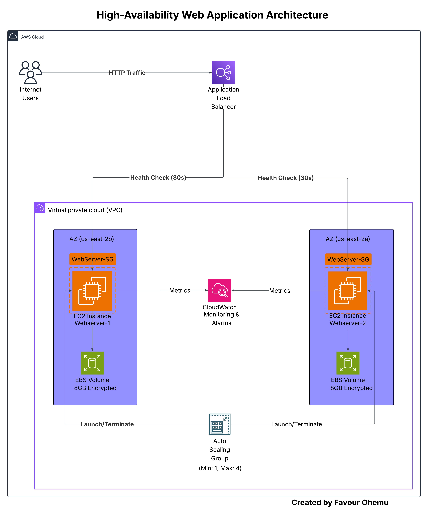
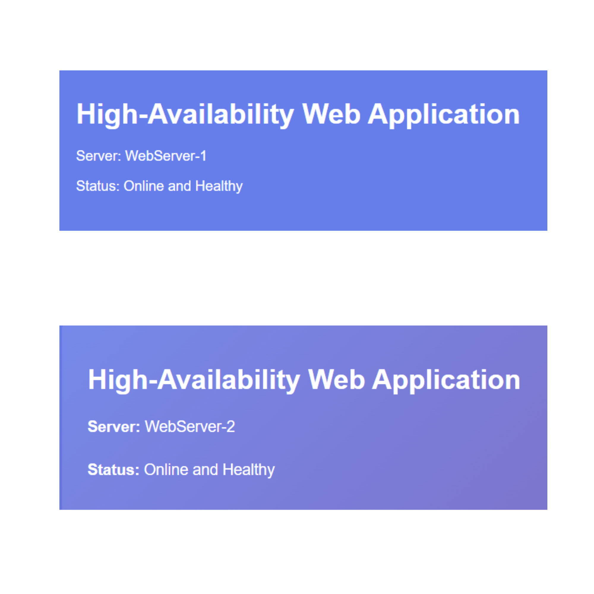
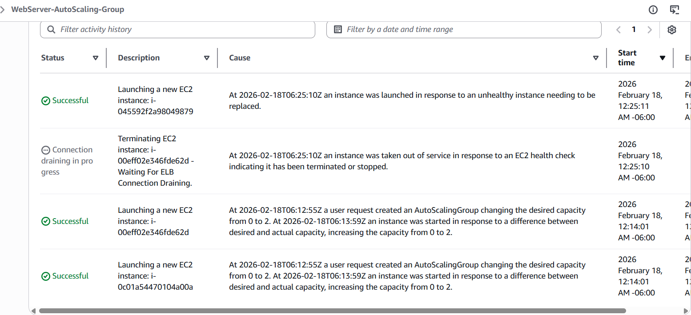
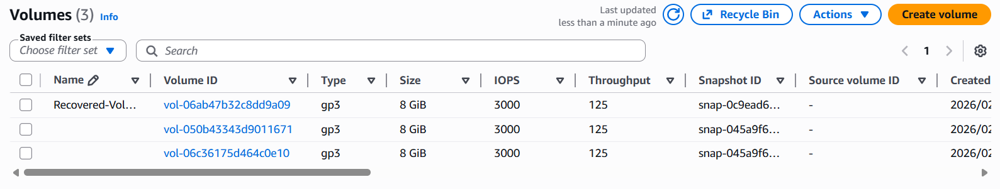
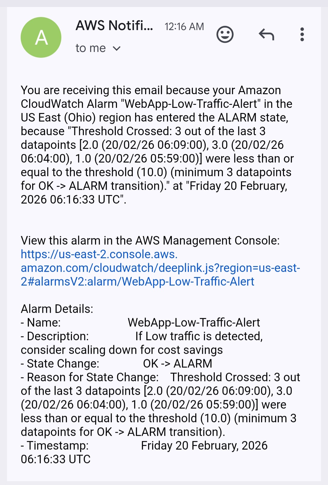
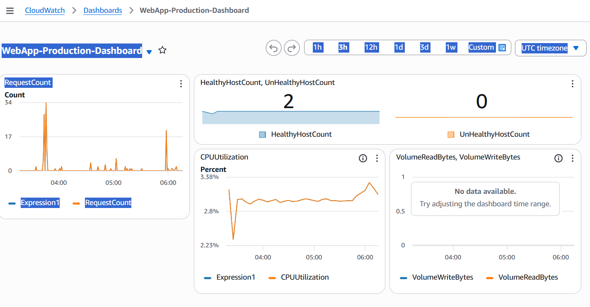

# AWS High-Availability Web Application

This project demonstrates how to build highly available web infrastructure that solves four critical business problems: downtime, security breaches, scalability issues, and disaster recovery failures.

## Problem Solved

Businesses face four critical challenges that cost millions annually:

1. **Downtime** - Website crashes cost $5,600 per hour (Gartner)
2. **Security** - Data breaches cost average $4.45M (IBM 2023)
3. **Scalability** - Servers crash during traffic spikes, losing 60-80% of sales
4. **Disaster Recovery** - Ransomware with no backups forces businesses to close

This infrastructure prevents all four.

## What I Built

- **Application Load Balancer**
Checks server health every 30 seconds, routes traffic only to healthy servers, and automatically fails over to backup servers when needed.

- **Auto Scaling Group**
Automatically replaces failed servers within 3 minutes, scales from 2 to 4 instances during traffic spikes, and scales down during low traffic to reduce costs.

- **Security Architecture**
Uses IAM roles instead of passwords or SSH keys, blocks access with security groups to keep servers hidden from direct internet exposure, and protects data at rest with encrypted EBS storage.

- **Disaster Recovery System**
Performs automated daily backups with a 7-day retention policy, enabling the entire system to be rebuilt within 15 minutes from snapshots and protecting against ransomware, accidental deletion, and data corruption.

- **CloudWatch Monitoring**
Provides a real-time dashboard for tracking server health and traffic, with email alerts for high CPU usage that trigger scaling, failed servers requiring immediate attention, and low traffic conditions for cost optimization.

## Architecture

The system is designed using four layers that work together:

**High Availability Layer:**
- Multi-AZ deployment (if one datacenter fails, traffic routes to other)
- Load balancer distributing traffic across zones
- Health checks with automatic replacement

**Security Layer:**
- IAM roles instead of passwords (prevents credential theft)
- Security groups implementing least-privilege access
- Encrypted volumes (HIPAA/PCI-DSS compliant)

**Auto Scaling Layer:**
- Maintains 2-4 instances based on CPU utilization
- Golden AMI for consistent 90-second deployments
- Automatic response to traffic changes

**Disaster Recovery Layer:**
- Daily automated snapshots at 3 AM UTC
- 7 day retention (can restore to any day last week)
- Cross-AZ replication for geographic redundancy

## Results

**Tested Load Balancing using the ALB public address :**
- Traffic alternates between WebServer-1 and WebServer-2
- Failed servers removed from rotation in less than 60 seconds
- Zero dropped requests during failures

**Tested Self-Healing by Terminating 1 instance:**
- Auto Scaling detected it 60 seconds
- Replacement launched in 180 seconds
- User-facing downtime: **0 seconds** 

**Tested Disaster Recovery :**
- Restored volume from snapshot
- Verification:  Data intact

**Tested Monitoring:**
- Real-time alerts within 90 seconds of issues
- Dashboard updates every 60 seconds
- Automatic email alert and alarm resolution when fixed

## Problems Encountered

**Problem 1: Website Wouldn't Load**

The servers were running, but nothing showed up in the browser. After about three hours of troubleshooting, I realized the issue wasn’t the server, it was the Security Group blocking direct browser access.

**What I did:** The Security Group was actually configured correctly for a production environment. The servers were meant to accept traffic only from the Load Balancer, not directly from the internet. The real issue was that I hadn’t created the Load Balancer yet. For testing, I temporarily allowed direct access, then reverted to the secure setup once the Load Balancer was in place.

**Learning:** Understanding why something doesn’t work can teach you more than when everything works perfectly.

**Problem 2: Second Server Showing Unhealthy**

WebServer-2 was flagged as unhealthy even though Apache was running normally. The Load Balancer health checks were failing because the  /health.html file didn’t exist.

**What I did:** I connected to the instance using Session Manager, manually created the health.html file, and confirmed the health check passed. I then updated the Golden AMI so all future instances would include this file automatically

**Learning:** I learnt health checks are important for load balancing. Without proper health check files, Load Balancer can't distinguish between running and broken servers.

## Technologies Used

**AWS Services:** EC2, Application Load Balancer, Auto Scaling, CloudWatch, EBS, IAM, VPC, SNS  
**Operating System:** Amazon Linux 2023  
**Web Server:** Apache HTTP Server (httpd)  
**Automation:** User Data scripts, Launch Templates, Lifecycle Policies  
**Security:** IAM Roles, Security Groups, KMS Encryption  
**Monitoring:** CloudWatch Dashboards and Alarms

## How to Run This Project

1. Create IAM role with SSM, CloudWatch, and S3 permissions
2. Create Security Groups (ALB + WebServer)
3. Launch 2 EC2 instances using `user-data.sh` across different AZs
4. Create Application Load Balancer and Target Group
5. Configure Auto Scaling Group (min: 1, desired: 2, max: 4)
6. Set up CloudWatch dashboard and alarms

**Note:** This is a summary of the setup process. The full implementation guide with detailed steps, screenshots, and troubleshooting tips is extensive but I'm happy to share it if you're interested. Just reach out!

## Files in This Repository

* `user-data.sh` - Bootstrap script for automatic server configuration
* `screenshots/` - Architecture diagram and testing evidence

